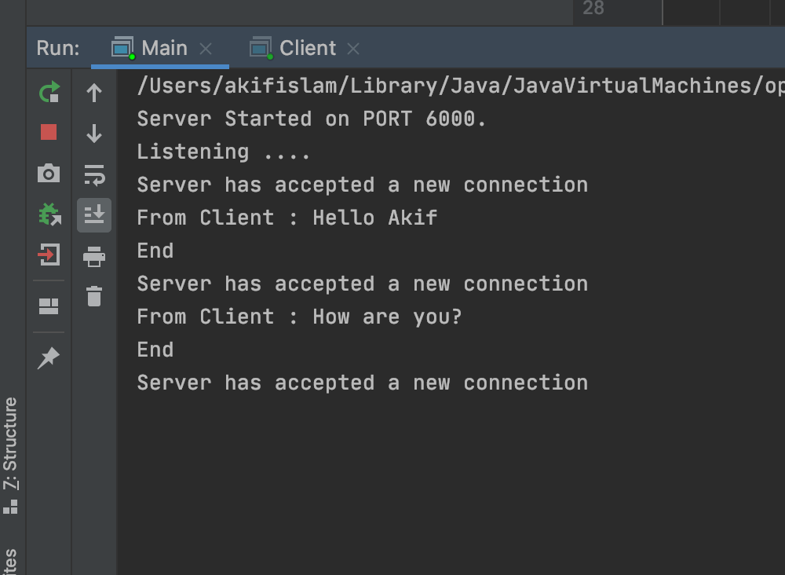
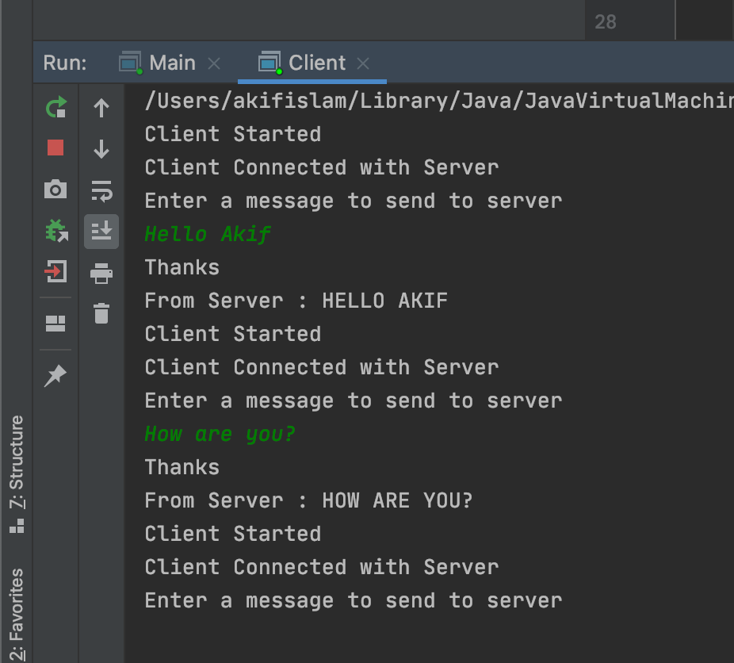

<h2 align="center">
  Java Socket Programming 
</h2>

## Server

   

 
 
 
## Client

  

 

You can fork this repo to modify and make changes of your own. Please Feel Free to send pull request with your updates [akifislam](https://github.com/akifislam). Thanks!

## Built With

- Java
- Jetbrain's IntelliJ

## Goal of this Project

- To learn Java socket programming
<h2 align="center">
Thanks
</h2>

